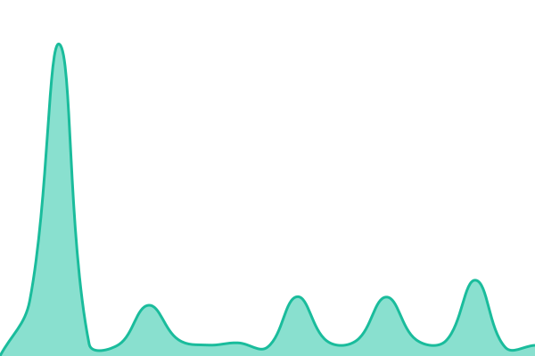
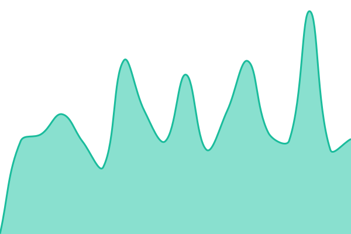
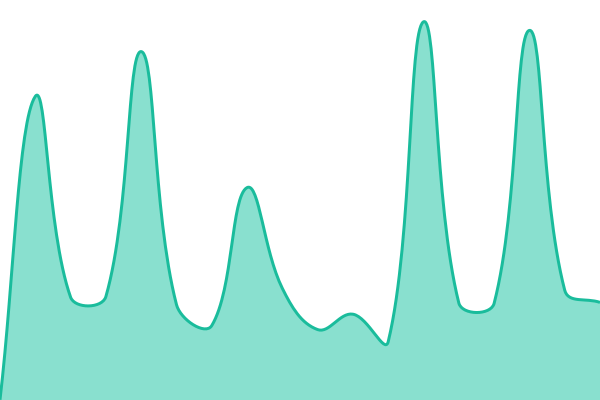
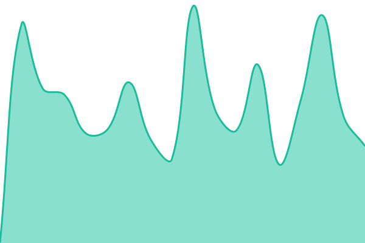

# [📈 Live Status](https://status.sg.augend.io): <!--live status--> **🟧 Partial outage**

This repository contains the open-source uptime monitor and status page for [AugendLimited](https://status.sg.augend.io), powered by [Upptime](https://github.com/upptime/upptime).

With [Upptime](https://upptime.js.org), you can get your own unlimited and free uptime monitor and status page, powered entirely by a GitHub repository. We use [Issues](https://github.com/AugendLimited/cimb-sg-upptime/issues) as incident reports, [Actions](https://github.com/AugendLimited/cimb-sg-upptime/actions) as uptime monitors, and [Pages](https://status.sg.augend.io) for the status page.

<!--start: status pages-->
<!-- This summary is generated by Upptime (https://github.com/upptime/upptime) -->
<!-- Do not edit this manually, your changes will be overwritten -->
<!-- prettier-ignore -->
| URL | Status | History | Response Time | Uptime |
| --- | ------ | ------- | ------------- | ------ |
|  [Django DEV Health](https://app-dev.sg.augend.io/health/) | 🟩 Up | [django-dev-health.yml](https://github.com/AugendLimited/cimb-sg-upptime/commits/HEAD/history/django-dev-health.yml) | 

 1033ms
     
 | 

<a href="https://status.sg.augend.io/history/django-dev-health">28.09%</a>
    

|  [Keycloak DEV OIDC](https://auth-dev.sg.augend.io/realms/cimb_singapore/.well-known/openid-configuration) | 🟩 Up | [keycloak-dev-oidc.yml](https://github.com/AugendLimited/cimb-sg-upptime/commits/HEAD/history/keycloak-dev-oidc.yml) | 

 613ms
     
 | 

<a href="https://status.sg.augend.io/history/keycloak-dev-oidc">46.47%</a>
    

|  [Django QA Health](https://app-qa.sg.augend.io/health/) | 🟩 Up | [django-qa-health.yml](https://github.com/AugendLimited/cimb-sg-upptime/commits/HEAD/history/django-qa-health.yml) | 

 846ms
     
 | 

<a href="https://status.sg.augend.io/history/django-qa-health">28.28%</a>
    

|  [Keycloak QA OIDC](https://auth-qa.sg.augend.io/realms/cimb_singapore/.well-known/openid-configuration) | 🟩 Up | [keycloak-qa-oidc.yml](https://github.com/AugendLimited/cimb-sg-upptime/commits/HEAD/history/keycloak-qa-oidc.yml) | 

 565ms
     
 | 

<a href="https://status.sg.augend.io/history/keycloak-qa-oidc">46.49%</a>
    

|  [Django UAT Health](https://app-uat.sg.augend.io/health/) | 🟥 Down | [django-uat-health.yml](https://github.com/AugendLimited/cimb-sg-upptime/commits/HEAD/history/django-uat-health.yml) | 

 893ms
     
 | 

<a href="https://status.sg.augend.io/history/django-uat-health">0.00%</a>
    

|  [Keycloak UAT OIDC](https://auth-uat.sg.augend.io/realms/cimb_singapore/.well-known/openid-configuration) | 🟥 Down | [keycloak-uat-oidc.yml](https://github.com/AugendLimited/cimb-sg-upptime/commits/HEAD/history/keycloak-uat-oidc.yml) | 

 912ms
     
 | 

<a href="https://status.sg.augend.io/history/keycloak-uat-oidc">3.37%</a>
    

|  [Django PROD Health](https://app-prod.sg.augend.io/health/) | 🟥 Down | [django-prod-health.yml](https://github.com/AugendLimited/cimb-sg-upptime/commits/HEAD/history/django-prod-health.yml) | 

 877ms
     
 | 

<a href="https://status.sg.augend.io/history/django-prod-health">0.00%</a>
    

|  [Keycloak PROD OIDC](https://auth-prod.sg.augend.io/realms/cimb_singapore/.well-known/openid-configuration) | 🟥 Down | [keycloak-prod-oidc.yml](https://github.com/AugendLimited/cimb-sg-upptime/commits/HEAD/history/keycloak-prod-oidc.yml) | 

 928ms
     
 | 

<a href="https://status.sg.augend.io/history/keycloak-prod-oidc">3.37%</a>
    

<!--end: status pages-->

[**Visit our status website →**](https://status.sg.augend.io)

## 📄 License

- Powered by: [Upptime](https://github.com/upptime/upptime)
- Code: [MIT](./LICENSE) © [Anand Chowdhary](https://anandchowdhary.com), supported by [Pabio](https://pabio.com)
- Data in the `./history` directory: [Open Database License](https://opendatacommons.org/licenses/odbl/1-0/)
